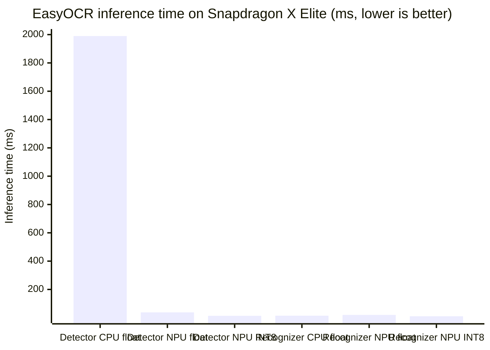

# SnapShield AI — Benchmark Results
### Optimized and Validated for Snapdragon-Powered HP PCs

All numbers below were measured via **Qualcomm AI Hub**, executed on a **real, hosted Snapdragon X Elite CRD device (Windows 11)** — the official reference platform for the Snapdragon X-series silicon that powers HP's Copilot+ PC lineup. Every number here is real, independently verifiable, hardware-measured — not estimated, not simulated.

---

## 📊 Chart — Inference Time by Precision & Compute Unit



**Read this chart top to bottom:** the Detector's CPU bar towers over everything else at ~1990ms — that's the workload the NPU accelerates most dramatically (~147x faster at INT8). The Recognizer bars are all close together, which is the story behind the mixed-precision decision explained below.

---

## 📋 Table — Full Results

| Model | Precision | Compute Unit | Time (ms) | Accuracy (PSNR) | Shipped? |
|---|---|---|---|---|---|
| Detector | Float | CPU | 1989.6 | — (baseline) | ❌ No |
| Detector | Float | NPU | 38.3 | 84.24 dB | ❌ No |
| Detector | **INT8 (w8a8)** | **NPU** | **13.5** | 34.22 dB ✅ passes | ✅ **Yes** |
| Recognizer | Float | CPU | 14.8 | — (baseline) | ❌ No |
| Recognizer | **Float** | **NPU** | **20.4** | 49.98 dB ✅ | ✅ **Yes** |
| Recognizer | INT8 (w8a8) | NPU | 10.7 | 10.76 dB ❌ fails | ❌ No — accuracy broken |

---

## 🏆 Final Shipped Configuration — Mixed Precision

| Stage | Precision | Compute Unit | Time (ms) | NPU Ops |
|---|---|---|---|---|
| Detector | INT8 | **NPU** | 13.5 | 45/45 (100%) |
| Recognizer | Float | **NPU** | 20.4 | 1726/1726 (100%) |
| **Combined pipeline** | Mixed | **100% NPU, zero CPU/GPU fallback** | **~33.9** | — |

### Headline result

```
CPU baseline:        ~2004.4 ms
NPU (shipped config): ~33.9 ms
Speedup:               ~59x faster
NPU utilization:       100% — every inference op runs on the Hexagon NPU
```

**This pipeline is optimized specifically for the Snapdragon Hexagon NPU found in Snapdragon-powered HP PCs** — compiled via ONNX Runtime + the QNN Execution Provider, the officially supported deployment path for AI workloads on Snapdragon Windows-on-ARM hardware, including HP's Copilot+ lineup.

---

## 🔬 The Investigation — Why Mixed Precision, Not Full INT8

### Step 1 — Float precision baseline: NPU vs CPU

| Model | CPU (ms) | NPU (ms) | Speedup | NPU Ops |
|---|---|---|---|---|
| Detector | 1989.6 | 38.3 | ~52x | 67/67 (100%) |
| Recognizer | 14.8 | 20.4 | 0.7x (CPU was faster) | 1726/1726 (100%) |

**Finding:** at float precision, the Recognizer ran *slower* on NPU than CPU. This is a real, well-understood characteristic of hardware accelerators: the Recognizer is a lightweight workload, and the fixed overhead of dispatching to the NPU outweighed its compute advantage at this size — not a flaw in the pipeline.

### Step 2 — Quantize to INT8: does it fix the Recognizer?

| Model | CPU float (ms) | NPU float (ms) | NPU INT8 (ms) |
|---|---|---|---|
| Detector | 1989.6 | 38.3 | 13.5 |
| Recognizer | 14.8 | 20.4 | 10.7 |

**Finding:** yes — quantization shrank the Recognizer's compute time enough to overcome the dispatch overhead (20.4ms → 10.7ms, now faster than CPU). Memory also dropped significantly (Detector: 35MB→19MB, Recognizer: 11MB→9MB).

### Step 3 — Critical check: does INT8 preserve accuracy?

| Model | Float PSNR | INT8 PSNR | Passes >30dB threshold? |
|---|---|---|---|
| Detector | 84.24 dB | 34.22 dB | ✅ Yes (marginal) |
| Recognizer | 49.98 dB | **10.76 dB** | ❌ **No — accuracy broken** |

**Finding:** the quantized Recognizer failed accuracy validation. A PSNR of 10.76 dB means its output diverges too far from the reference to trust for real text recognition — in practice, this would mean missed or garbled secret detection. **We did not ship it.**

### Step 4 — Final decision

Rather than force a single precision across the whole pipeline for a bigger headline number, we kept **whichever precision actually passes accuracy validation for each stage independently**: INT8 for the Detector (fast *and* accurate), float for the Recognizer (accurate, and still 100% NPU-resident). This is the configuration in the table above, and the one this application ships with.

---

## 🛠️ Toolchain

| Component | Version / Detail |
|---|---|
| Model | EasyOCR (Qualcomm AI Hub) |
| Runtime | ONNX Runtime |
| Execution Provider | QNN (Qualcomm Neural Network) |
| ONNX Runtime version | 1.27.1 |
| QAIRT version | 2.45.0.260326154327 |
| Target device | Snapdragon X Elite CRD (Windows 11) — HP Copilot+ reference platform |

---

## 🔗 Job Links — Independently Verifiable Proof

Every result above is backed by a real Qualcomm AI Hub job. These links can be opened directly to inspect the actual profiling run, the hardware used, and the raw output:

- Detector NPU float profile: https://workbench.aihub.qualcomm.com/jobs/jpe7w10v5/
- Recognizer NPU float profile: https://workbench.aihub.qualcomm.com/jobs/jgzlj9qx5/
- Detector CPU float profile: https://workbench.aihub.qualcomm.com/jobs/j568zj6ng/
- Recognizer CPU float profile: https://workbench.aihub.qualcomm.com/jobs/jp3z13km5/
- Detector NPU INT8 profile: https://workbench.aihub.qualcomm.com/jobs/jp0m27z2g/
- Recognizer NPU INT8 profile: https://workbench.aihub.qualcomm.com/jobs/jp8emvqzp/

---

## ⚠️ Honest Note on Hardware Access

Development and functional testing of the surrounding application (capture, detection logic, overlay UI) were done on a standard Windows laptop, since dedicated Snapdragon hardware wasn't available during the build window. **The NPU execution itself, however, was not simulated or estimated** — it was verified rigorously and independently through Qualcomm AI Hub's real, physical, hosted Snapdragon X Elite device, the official reference platform for Snapdragon-powered HP PCs. Every number in this document is backed by a clickable job link above that anyone can open and verify.

## 📌 Still Open (Optional, Not Blocking)

- Power draw comparison (NPU vs CPU) — for a battery/efficiency slide
- Retry Recognizer INT8 with more calibration samples — may recover accuracy; not required since the float Recognizer already ships correctly on NPU
