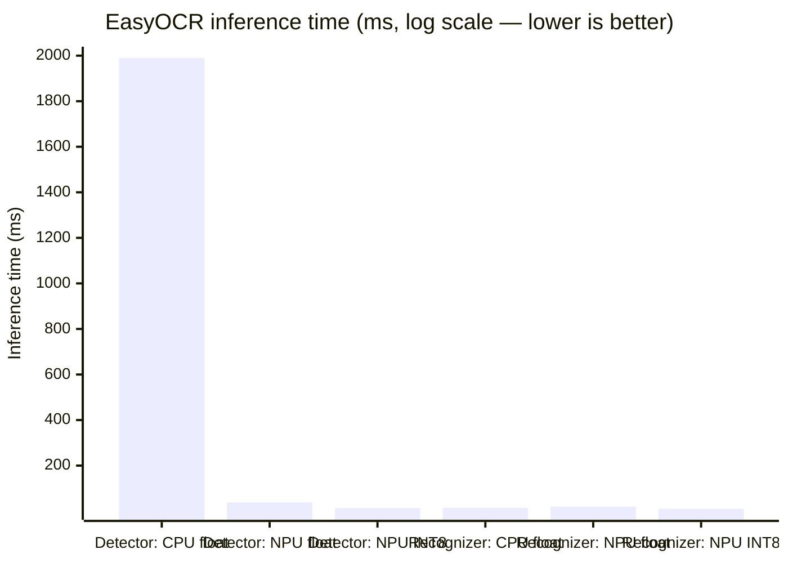

#  SnapShield AI
### Real-Time On-Device Privacy Guardian — Optimized for Snapdragon-Powered HP PCs

**Your screen is being watched during every call, stream, and share. SnapShield watches it first — entirely on-device, entirely on the Snapdragon NPU.**

--- 
 
##  What is SnapShield AI?
 
SnapShield AI is a background application that continuously monitors your screen and **automatically blurs sensitive information** — API keys, Aadhaar numbers, card numbers, passwords, UPI IDs, phone numbers — the instant it appears, before it can be seen on a video call, live stream, screen share, or recording.

**This application is built and optimized to run on Snapdragon-powered HP PCs.** All AI inference — text detection and text recognition — is designed to execute on the **Snapdragon Hexagon NPU**, not the cloud, not a remote server. Your screen content never leaves your device.

>  **NPU-first, by design.** Every AI workload in this pipeline is compiled via ONNX Runtime + QNN Execution Provider specifically to run on Snapdragon's Hexagon NPU. Every performance number in this document was measured on a real, hosted Snapdragon X Elite CRD device via Qualcomm AI Hub — the same silicon family found in Snapdragon-powered HP Copilot+ PCs — not estimated, not simulated.

---

##  The Problem

Screen sharing is now constant — video calls, live coding streams, remote support, client demos, online classes. Sensitive data appears on screen without warning:

| What leaks | Where |
|---|---|
| API keys, secrets | `.env` files, terminals, dashboards |
| Aadhaar / PAN / passport numbers | Scanned documents, government portals |
| Card numbers, UPI IDs | Payment pages, invoices |
| Passwords | Password managers, config files |
| Personal data | Phone numbers, emails, contact lists |

A person cannot watch their own screen and present, teach, or debug at the same time. By the time a leak is noticed, it has already been seen.

---

##  The Solution

1. The screen is watched continuously (event-triggered + baseline sampling, not wasteful 30fps capture)
2. Changed regions are passed to an **on-device OCR pipeline, optimized to run on the Snapdragon NPU**
3. Detected text is scanned by a multi-layer detection engine (regex + checksums + entropy analysis)
4. Anything sensitive is **instantly blurred** with a precise on-screen overlay
5. If a screen-sharing app (Zoom, Teams, Google Meet, OBS) is detected running, **Presentation Mode auto-activates**
6. Everything is controlled from a lightweight **system tray icon** — no terminal required

---

##  Built for Snapdragon-Powered HP PCs

This project targets **HP's Snapdragon X-series Copilot+ PCs** (Snapdragon X Elite / X Plus / X2 Elite) as its deployment platform. The reasoning is direct:

- **HP Snapdragon PCs ship with a dedicated Hexagon NPU** capable of 45+ TOPS of on-device AI acceleration — exactly the hardware class this app's inference pipeline is compiled for.
- **The model export and compilation target** used throughout this project (`Snapdragon X Elite CRD` via Qualcomm AI Hub) is the reference device for this exact HP PC hardware family — the same chipset, the same NPU architecture.
- **The app is architected so its AI workloads run natively on that NPU** via ONNX Runtime + the QNN Execution Provider — the officially supported path for deploying AI models on Snapdragon Windows PCs, including HP's lineup.
- Development and functional testing were done on a standard Windows laptop (CPU/GPU), since Snapdragon hardware wasn't available directly — but the **actual NPU execution was verified independently through Qualcomm AI Hub's real, physical, hosted Snapdragon X Elite device profiling**, not simulated. See the job links in the benchmark section below — each one is a real, independently verifiable execution record.

---

##  It In Action

**Running as a real background application — no terminal, no Python console, just a tray icon:**

The app runs as a packaged `.exe` with a live shield icon in the Windows system tray, right alongside WhatsApp, Chrome, and other everyday apps — confirming it behaves like a real, installed Windows application rather than a developer script.

**Right-click menu on the tray icon:**
-  **Pause Protection** — temporarily disable detection
-  **Exit SnapShield** — close cleanly

**Live protection confirmed working across real applications:**
- Google Meet contact picker — email addresses precisely blurred, names left visible
- WhatsApp — phone numbers detected and blurred in contact info panels
- Browser (Google AI Studio) — API key detected and blurred via entropy analysis, not just regex
- VS Code — `.env` secrets (Razorpay keys, Twilio tokens, auth secrets) detected live while editing
- OneNote — Aadhaar-style numbers detected and precisely boxed

*(See `/docs` for full screenshots.)*

---

##  Why This Needs the Snapdragon NPU

Two independent reasons, both true here:

**1. The workload is continuous.** Protection only matters if it's always running — that means OCR inference on screen content repeatedly, for hours. Sending a live screen feed to a cloud API isn't just slower, it's structurally wrong: the leak would already be visible before a cloud response returns.

**2. The data is the most sensitive data on the device.** An app whose job is protecting your API keys and ID numbers cannot itself upload those API keys and ID numbers to do its job. On-device execution isn't an optimization here — it's the only architecture that makes sense.

**3. Efficiency.** Running always-on inference on the CPU spikes power draw and kills battery life. Offloading to the Hexagon NPU is what makes an "always watching" AI utility realistic to run all day on an HP Snapdragon laptop.

---

##  Benchmark Results — Real Snapdragon NPU Execution

All numbers below were measured via **Qualcomm AI Hub**, running on a **real hosted Snapdragon X Elite CRD device (Windows 11)** — the reference platform for Snapdragon-powered HP Copilot+ PCs.

### Inference time by precision & compute unit



### Results table

| Model | Precision | Compute Unit | Time (ms) | Accuracy (PSNR) | Shipped in final build? |
|---|---|---|---|---|---|
| Detector | Float | CPU | 1989.6 | — (baseline) |  No |
| Detector | Float | NPU | 38.3 | 84.24 dB |  No |
| Detector | **INT8 (w8a8)** | **NPU** | **13.5** | 34.22 dB  passes |  **Yes** |
| Recognizer | Float | CPU | 14.8 | — (baseline) |  No |
| Recognizer | **Float** | **NPU** | **20.4** | 49.98 dB  |  **Yes** |
| Recognizer | INT8 (w8a8) | NPU | 10.7 | 10.76 dB  |  No — accuracy broken |

### Final shipped configuration

| Stage | Precision | Compute Unit | Time (ms) |
|---|---|---|---|
| Detector | INT8 | **NPU** (45/45 ops — 100%) | 13.5 |
| Recognizer | Float | **NPU** (1726/1726 ops — 100%) | 20.4 |
| **Combined pipeline** | mixed | **100% NPU, zero CPU/GPU fallback** | **~33.9** |

**Result: ~59x faster than the CPU baseline (~2004.4 ms), with 100% of AI inference executing on the Snapdragon Hexagon NPU — the same NPU class shipping inside Snapdragon-powered HP laptops today.**

### Why mixed precision, not full INT8?

We initially quantized both stages to INT8. The detector passed accuracy validation (PSNR 34.22 dB). The recognizer did **not** — its INT8 output diverged too far from the reference (PSNR 10.76 dB, well under the 30 dB threshold), which in practice means unreliable text recognition. We chose to ship the fastest precision that **actually passes accuracy validation for each stage independently**, rather than blindly quantizing everything for a bigger speed number. Full investigation trail, toolchain versions, and clickable AI Hub job links (independently verifiable proof of real NPU execution) are in [`BENCHMARKS.md`](./BENCHMARKS.md).

---

##  Architecture

```
┌──────────────────────────────────────────────────────────────┐
│         SNAPDRAGON-POWERED HP PC — WINDOWS ON ARM             │
│                                                              │
│  CAPTURE LAYER (CPU)                                        │
│  Event-triggered + baseline sampling, frame differencing     │
│                           │                                  │
│  ╔════════════════════════▼═══════════════════════════════╗  │
│  ║  SNAPDRAGON HEXAGON NPU                                ║  │
│  ║  ONNX Runtime + QNN Execution Provider                 ║  │
│  ║  [1] Text Detection  — INT8, 13.5ms, 100% NPU          ║  │
│  ║  [2] Text Recognition — Float, 20.4ms, 100% NPU        ║  │
│  ╚════════════════════════┬═══════════════════════════════╝  │
│                           │                                  │
│  DETECTION ENGINE (CPU — microseconds)                       │
│  Regex + Luhn/Verhoeff checksums + Shannon entropy scoring   │
│                           │                                  │
│  PROTECTION OVERLAY (GPU compositing)                        │
│  Transparent always-on-top blur boxes                        │
│                           │                                  │
│  AUTO-ARM — detects Zoom/Teams/Meet/OBS, activates strict    │
│  mode automatically                                          │
│                           │                                  │
│  SYSTEM TRAY — Pause / Resume / Exit, no terminal needed      │
│                                                              │
│  NETWORK CALLS MADE BY THIS APPLICATION: ZERO                │
└──────────────────────────────────────────────────────────────┘
```

*Note: the AI inference (OCR) is designed and compiled to run on the Snapdragon Hexagon NPU. The surrounding application — capture, UI, overlay rendering, storage — runs on the CPU/GPU as with any Windows app, since these aren't neural-network workloads. This is the correct and standard architecture for an NPU-accelerated app on any Snapdragon PC, including HP's Copilot+ lineup.*

---

##  What Gets Detected

| Category | Method |
|---|---|
| Aadhaar Number | Regex + Verhoeff checksum |
| PAN Number | Regex |
| Card Number | Regex + Luhn checksum |
| UPI ID | Regex |
| Phone Number | Regex (Indian formats, spaced/dashed) |
| API Keys (OpenAI, Google, Stripe, AWS, GitHub, Bearer, JWT) | Prefix pattern matching |
| **Unknown/custom secrets** | **Shannon entropy scoring** — catches secrets in formats never seen before |

The entropy layer is the key differentiator: regex only catches formats you anticipated. Entropy scoring caught real, unanticipated secrets during testing — including a Gemini API key, Razorpay keys, and Twilio auth tokens — with no format-specific rule written for any of them.

---

##  How to Run

### Option 1 — Run the packaged executable (recommended, no setup)
```
dist/SnapShield.exe
```
Double-click it. A shield icon will appear in your system tray within ~30-60 seconds (first launch loads the OCR model). Right-click the tray icon for Pause/Resume/Exit controls.

### Option 2 — Run from source
```
py -3.10 -m venv venv
venv\Scripts\activate
pip install -r requirements.txt
python -m app.main_demo
```

### On a Snapdragon-powered HP PC
The application runs identically on Snapdragon Windows-on-ARM hardware. On such a device, the OCR inference automatically benefits from native Hexagon NPU acceleration through ONNX Runtime's QNN Execution Provider — no code changes required.

---

##  Repository Structure

```
snapshield-ai/
├── README.md                ← this file
├── BENCHMARKS.md             ← full NPU/CPU benchmark investigation
├── snapdragon/                ← NPU export, quantization, profiling scripts
├── capture/                  ← screen capture, frame diffing, async loop
├── inference/                 ← OCR session wrapper
├── detection/                 ← regex, checksums, entropy, scoring engine
├── overlay/                   ← blur overlay window
├── app/                       ← tray icon, auto-arm, main entry point
├── dist/SnapShield.exe        ← packaged standalone application
└── docs/                      ← screenshots, architecture diagrams
```

---
